<div align="center">
  
</div>

<!-- profile:about:start -->
I build software, design systems, connect things that were never designed to talk to each other, and occasionally convince data to behave.
My work sits where application development, cloud architecture, data engineering, and enterprise integration meet. I enjoy problems where the answer is not only “write some code,” but first figuring out how the whole system should fit together.
<!-- profile:about:end -->

### `> current_focus`

<!-- profile:focus:start -->
- Local-first AI and useful developer tools
- Reliable cloud and integration architecture
- Data platforms, metadata, lineage, and observability
<!-- profile:focus:end -->

### `> currently_building`

<!-- profile:building:start -->
| Project | What it is solving | State |
|---|---|---|
| Architecture notebook | Reusable patterns and decision records for systems that need to last | `shipping notes` |
| Local AI experiments | Small, private-by-default tools that make everyday work faster | `exploring` |
| Data reliability toolkit | Practical checks around pipelines, contracts, metadata, and lineage | `designing` |
<!-- profile:building:end -->

### `> capabilities --grouped`

<!-- profile:skills:start -->
| Capability | Tools and territory |
|---|---|
| **Build** | Python · TypeScript · JavaScript · APIs · backend services · automation |
| **Architect** | Cloud systems · distributed systems · solution design · integration patterns · security-minded design |
| **Data** | SQL · ETL/ELT · lakehouse patterns · data modelling · metadata · lineage · observability |
| **Operate** | CI/CD · containers · GitHub Actions · monitoring · reliability · technical documentation |
<!-- profile:skills:end -->

### `> recent_activity --limit 5`

<!--START_SECTION:activity-->
_This section fills itself after the “Update profile” Action runs._
<!--END_SECTION:activity-->

<details>
<summary><code>&gt; weekly_coding_signal --optional</code></summary>

Add a `WAKATIME_API_KEY` repository secret to turn this on. If you do not use WakaTime, leave it exactly as it is.

<!--START_SECTION:waka-->

```txt
Python       1 hr 48 mins          ████████▓░░░░░░░░░░░░░░░░   34.64 %
Git Config   49 mins               ████░░░░░░░░░░░░░░░░░░░░░   15.76 %
JavaScript   38 mins               ███░░░░░░░░░░░░░░░░░░░░░░   12.25 %
CSS          35 mins               ██▓░░░░░░░░░░░░░░░░░░░░░░   11.15 %
Markdown     31 mins               ██▓░░░░░░░░░░░░░░░░░░░░░░   10.02 %
TypeScript   24 mins               ██░░░░░░░░░░░░░░░░░░░░░░░   07.66 %
```

<!--END_SECTION:waka-->

</details>

### `> contributions --animate`

<picture>
  <source media="(prefers-color-scheme: dark)" srcset="https://raw.githubusercontent.com/ayush2599/ayush2599/output/github-contribution-grid-snake-dark.svg" />
  <source media="(prefers-color-scheme: light)" srcset="https://raw.githubusercontent.com/ayush2599/ayush2599/output/github-contribution-grid-snake.svg" />
  
</picture>

### `> outside_the_terminal`

<!-- profile:outside:start -->
I like the part of making things that does not fit neatly into a ticket: visual experiments, thoughtful writing, and collecting ideas from outside software. Selected work will appear here as it becomes ready to share.
<!-- profile:outside:end -->

---

<!-- profile:joke:start -->
> “It works on my machine. So we are shipping my machine.”
<!-- profile:joke:end -->

<!-- profile:links:start -->
<p align="center">
  <a href="https://github.com/ayush2599">GitHub</a>
  ·
  <a href="https://www.linkedin.com/in/ayush-karn25/">LinkedIn</a>
  ·
  <a href="mailto:ayush.karn25@gmail.com">Email</a>
</p>
<!-- profile:links:end -->

<p align="center"><sub>Designed as a small architecture console—not a badge collection.</sub></p>
